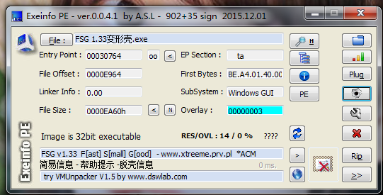
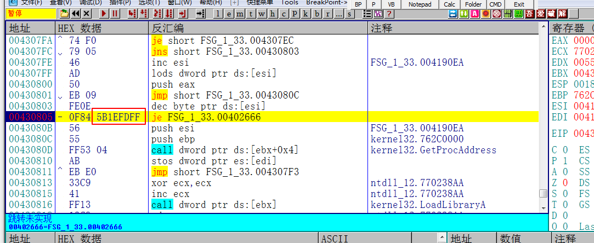
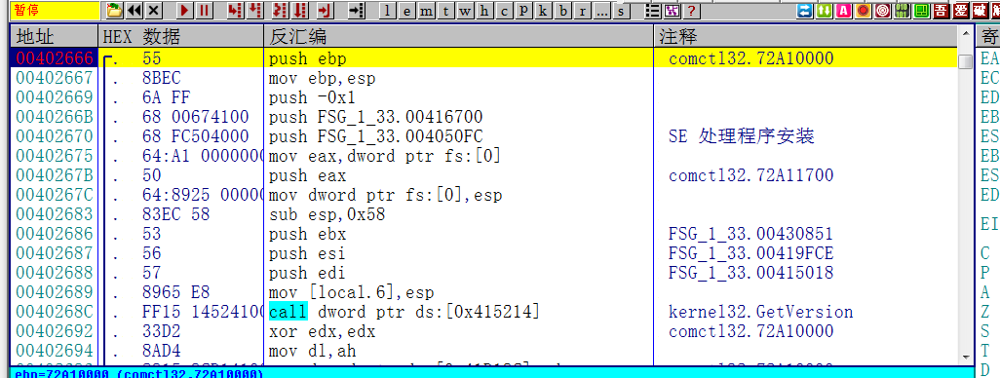
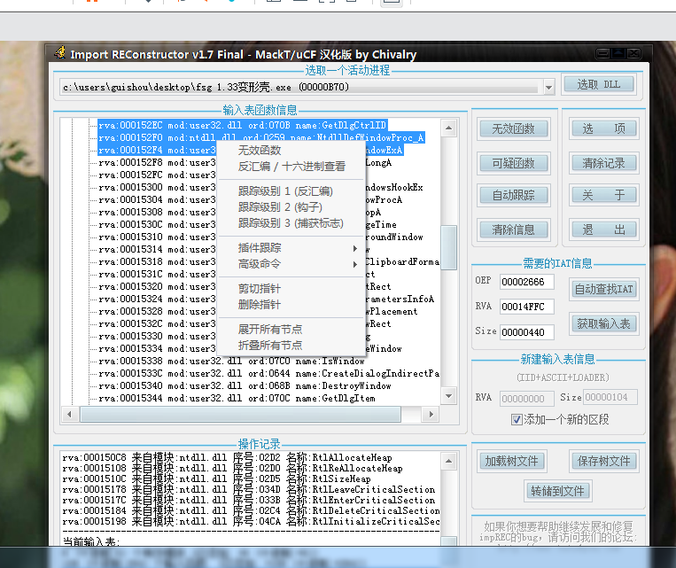
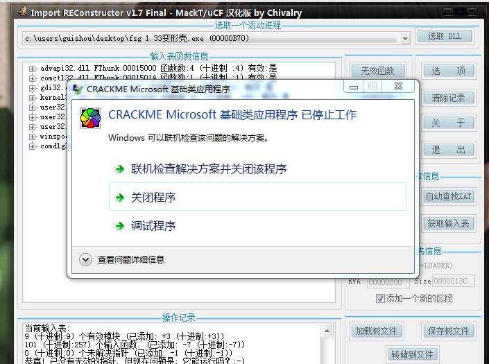
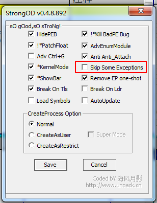
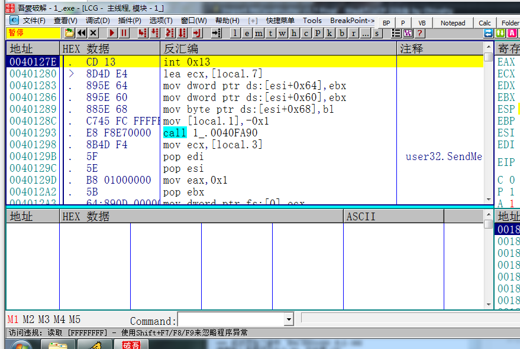
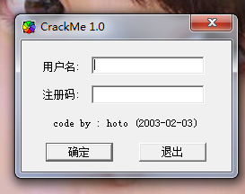

[TOC]

## 查壳

首先来查一下壳，是FSG1.33的壳，不过是个变型壳。

## OD脱壳

关于FSG的壳有一个特点，只要一直往下拉找到一个远跳，这个远跳跟过去就是OEP的位置。然后在这里下断点F7就能到达OEP。

关于如何快速识别远跳，我是通过OpCode的方式。可以看到上图框起来的地方就是目标地址减去当前地址的偏移，当这个地址值比较大的时候，就能确定这是个远跳。

接着再je处按回车键跟随，分析代码 下断点。

就直接到达OEP了。

## 修复导入表

接下来dump文件，

输入OEP，查找IAT，获取输入表，有几个无效函数需要剪切掉。然后转储文件。运行，

程序居然无法运行，说明肯定是遇到某个异常了，将修复好导入表的程序载入OD，

## 修复程序

设置忽略所有异常，同时要把StrongOD的这个勾给取消掉。直接F9运行。

程序断在了这里，并且显示访问违规，抛出一个异常，而程序本身无法处理这个异常，所以导致直接奔溃。那么只要把这条指令给nop掉就可以了。

nop掉之后，脱壳后的程序是可以正常运行的。

需要相关文件可以到我的Github下载:https://github.com/TonyChen56/Unpack-Practice