[TOC]

## 查壳

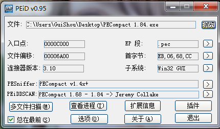

今天来脱一下PECompact 1.84这个壳，脱这个壳的目的是为了了解一个技巧——当遇到无法向下跟随的时候，可以找到附近没有实现的大跳转，下断点继续跟踪。

## 单步跟踪到OEP

接下来OD载入这个程序，采用单步跟踪的方法脱掉这个压缩壳。

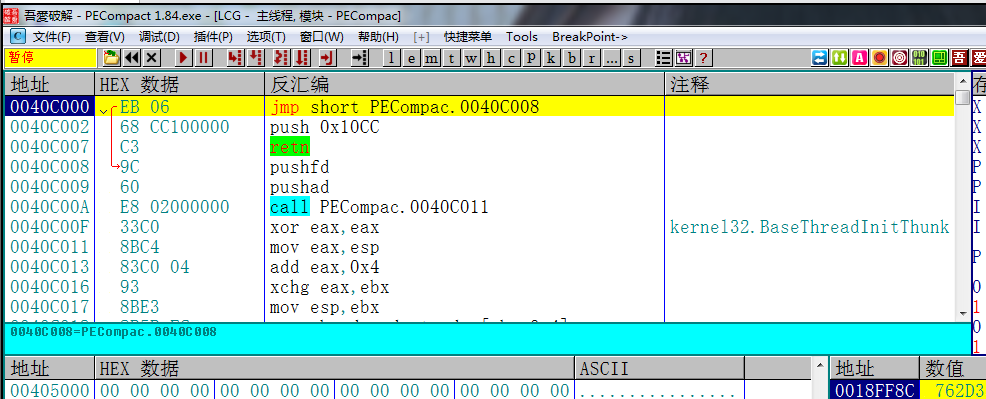

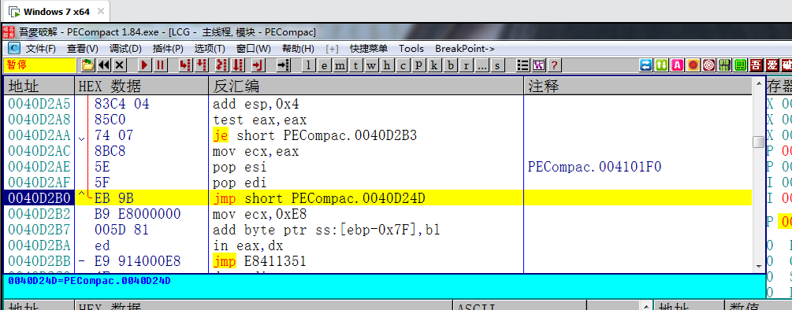

当程序执行到这个位置的时候，这里有一个jmp是往上跳的，按照常规的单步跟踪脱壳的方法，我们应该直接在下一条命令处F4，让他执行到下一条命令。但是当你在下一条命令直接F4的时候，程序会直接跑飞。

这个时候就要用到刚才的技巧了，在附近寻找一个没有实现的大跳转，一般是在上面。一直往上拉，

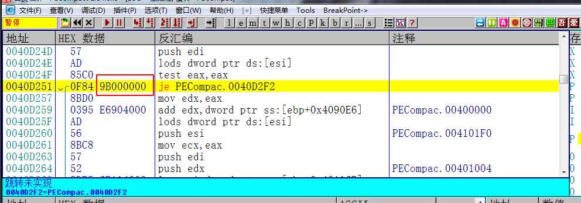

在程序上面我们看到一个je，后面的OpCode的offset代表这是一个大跳转，而且是没有实现的。

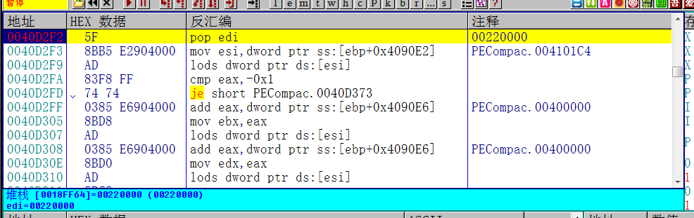

那么我们就可以直接跟进去，下断点，让程序断下，然后继续单步跟踪。

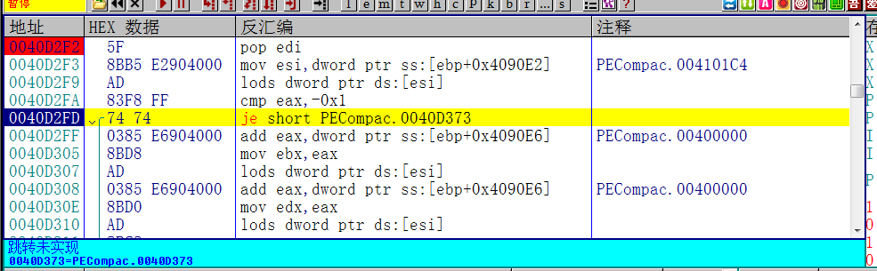

这里也是一个大跳转，按照刚才的方法，回车跟进去下断点，F9跑起来，就到了这里。继续往下跟

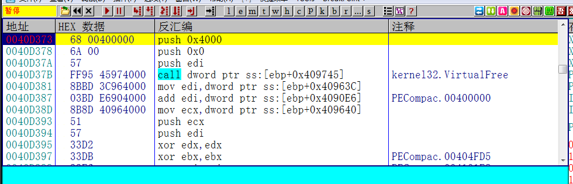跟到这里的时候，同样，回车跟进去下断点F9

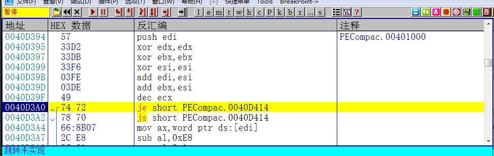

这里还是一样的套路，继续跟

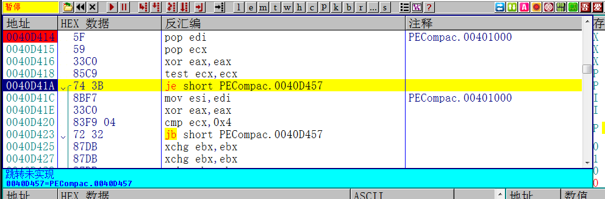

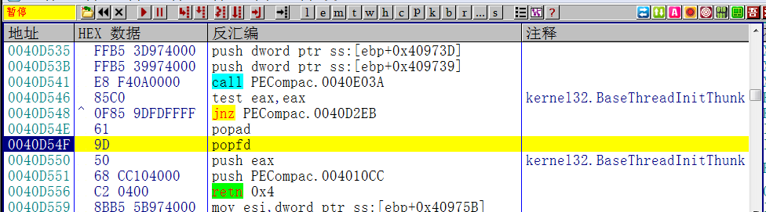

当跟到这里的时候，可以知道马上就到了OEP了，和大部分壳的套路一样，会push一个地址，然后返回回去。

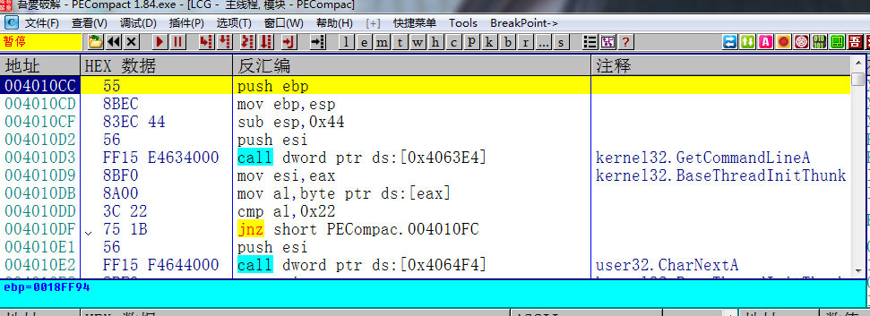

接着就来到了熟悉的OEP。

## 修复导入表

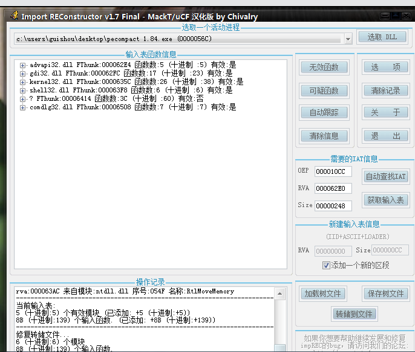

然后在OD里dump文件，然后修复导入表，输入OEP，自动查找IAT，获取输入表，转储文件。

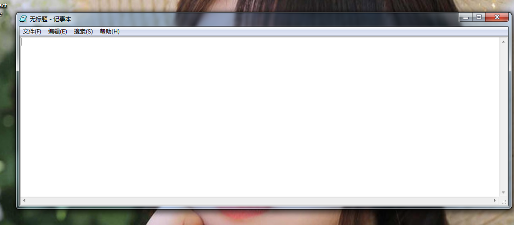

脱壳后的程序正常运行，这个壳也就完成了。当然了，这个壳用ESP定律也是可以秒脱的，我这里纯粹是为了练习这个技巧而已。

需要相关文件可以到我的Github下载:https://github.com/TonyChen56/Unpack-Practice