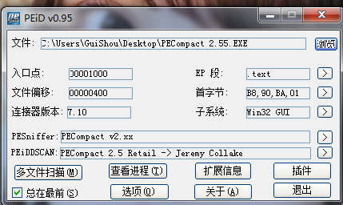
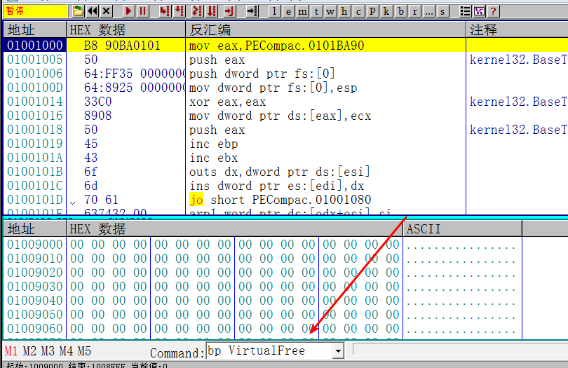
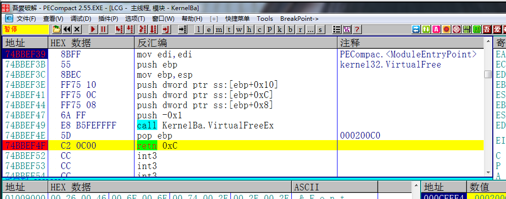
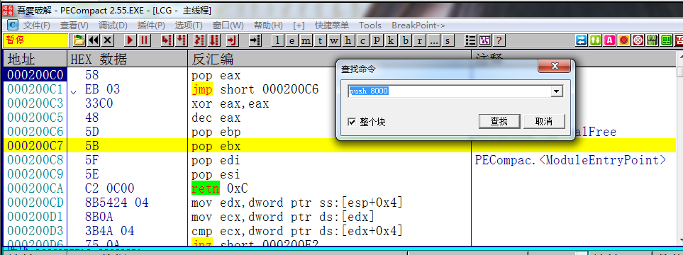
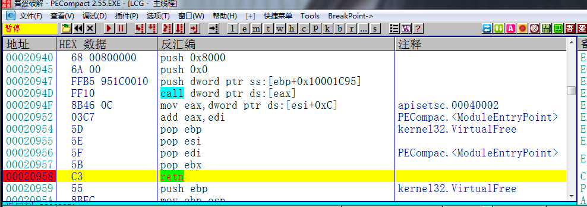
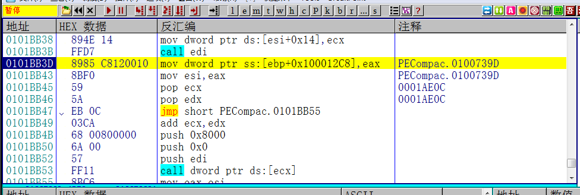
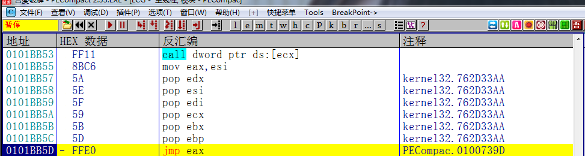
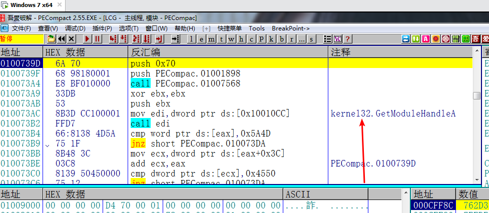
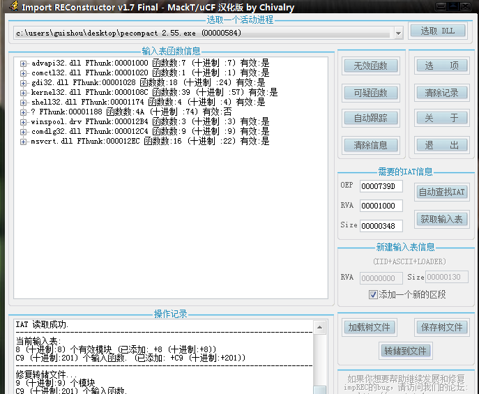
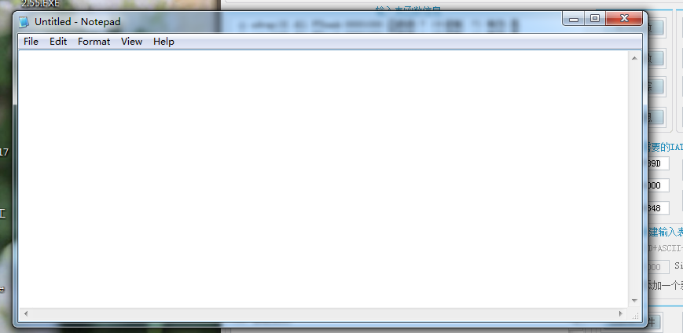

[TOC]

## 查壳

这个目标程序是PECompact 2.55的壳。脱这个壳的时候需要用一些技巧和套路。

## 单步跟踪查找OEP

OD载入，

首先我们需要在VirtualFree下一个API断点，之所以下这个断点是因为壳在解压或者解密代码段的时候都需要申请一块空间来进行解密或解压操作，当VirtualFree完成之后，说明壳的解密或解压操作完成。

然后直接F9运行，

断在了VirtualFree处，接下来在retn处下断点，返回到用户代码区，我的Alt+F9执行到用户代码没有用，所以只好采取这种方法了。

接着我们查找push 8000这条命令，为什么要查找这条命令我也不知道，大概是前辈们总结出来的经验吧。就跟FSG壳的脱壳套路类似，每个壳都有一个套路。

找到push 8000之后，在retn处下断点。F9执行，就来到了这个地方

一直单步几下，

这一连串的指令就相当于popad了，这条指令F7之后就到达OEP了。

在这里看到了GetModuleHandleA，说明这个就是入口点了。

## 修复导入表

接下来dump文件，自动查找IAT 获取输入表，这里有无效指针不能剪切掉，如果剪切掉了转储的程序就无法正常运行。接着转储文件。

脱壳后的程序正常运行。

需要相关文件可以到我的Github下载:https://github.com/TonyChen56/Unpack-Practice

