[TOC]

## 前言

最近一直在看脱壳的相关资料，看到了Tuts4you社区脱壳脚本的教程，这个壳我感觉很不错，挺有意思的，于是打算将内容整理下分享出来。

## 查壳

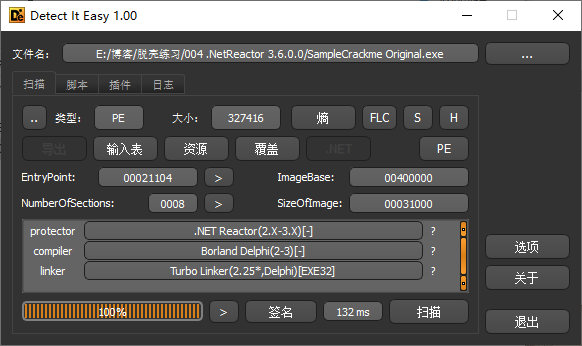

这个壳是.NetReactor 3.6.0.0的版本。根据作者的介绍，这个壳只是一个包装器，它包装目标程序，然后将其全部解包到内存中执行。但是这是一种不安全的方法，因为有人可以将内存中的目标程序转储回文件并完全恢复程序集。这个壳的重点在于转储之后的修复，需要对PE文件有一定的了解。

## 脱壳

接下来直接载入OD，F9让程序运行起来。

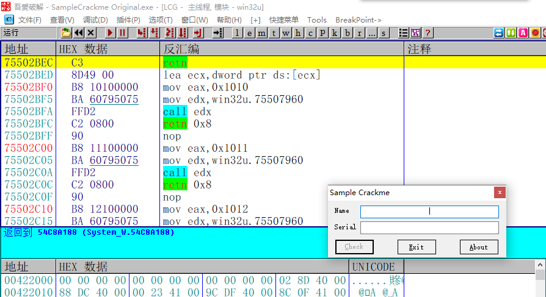

接着调出内存窗口，为了锁定目标程序被解压的位置，因为这个crackme实际上也是作者写的，所以选择通过搜索关键字符串的方法，搜索Crackme

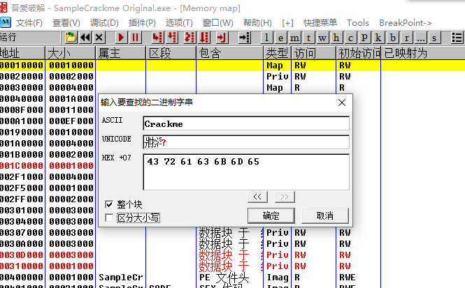

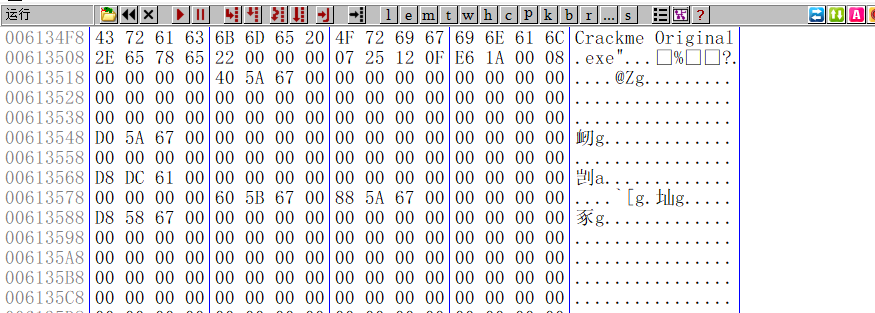

搜索到关键字符串之后向上滚动，查找PE文件，如果找到了说明这里就是目标文件解压缩的地方。

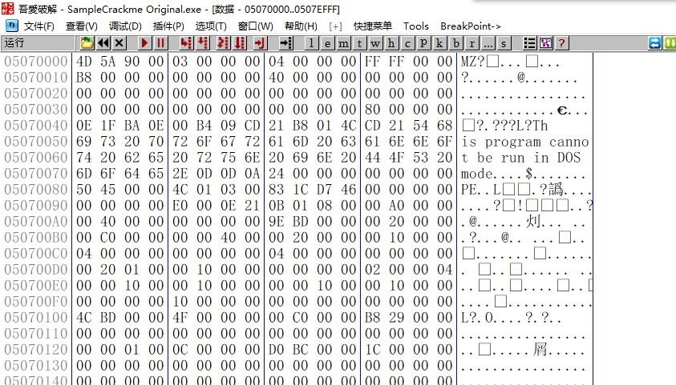

经过搜索和寻找，我们在第六次搜索结果中找到了要找的PE文件。

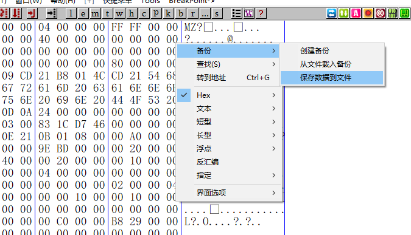

接着右键->备份->保存数据到文件。

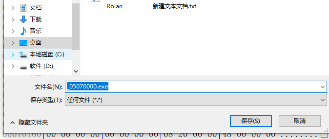

选择保存类型为任何文件，并修改后缀名为exe。

接着测试运行一下，弹出一个错误框，无法在电脑上运行。这很正常，因为直接dump下来的文件在PE头总是会出现问题。因为我是在本机上跑的，如果是W7的话应该是显示不是有效的W32程序。

## 修复目标程序

接下来用CFF Explorer这款PE工具来修复一下目标程序。

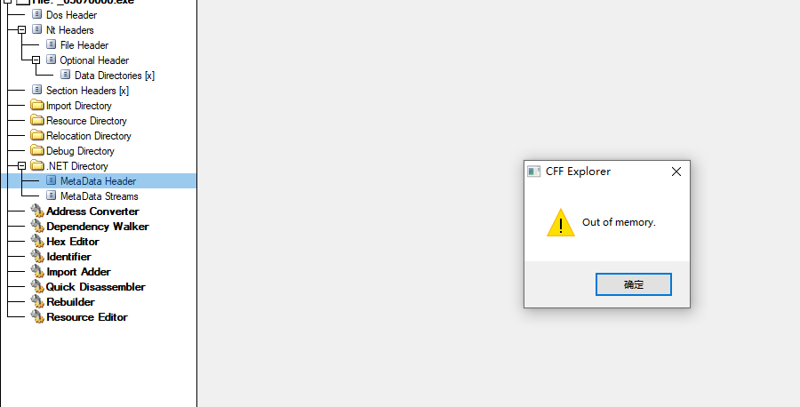

载入目标程序，点击Header部分，错误提示为Out of memory。

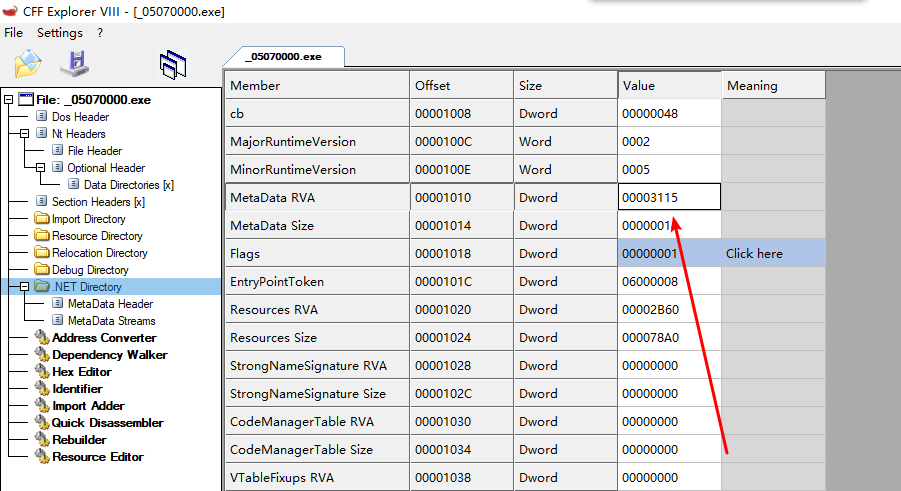

接下来进入到Driectory部分，修复MetaData Header的错误。我们需要修复这个错误的RVA和Size，Size明显是错的，太小了。

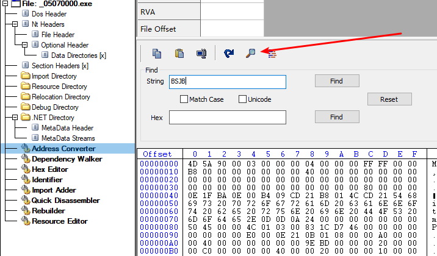

接着来到Address Converter部分，点击这个放大镜，查找字符串BSJB。至于为什么搜索这么一串字符串，作者给出的解释是这个字符串的Offset就是要修复的Meta Data的Offset。(我也是一脸蒙蔽 这解释有点太勉强了吧)

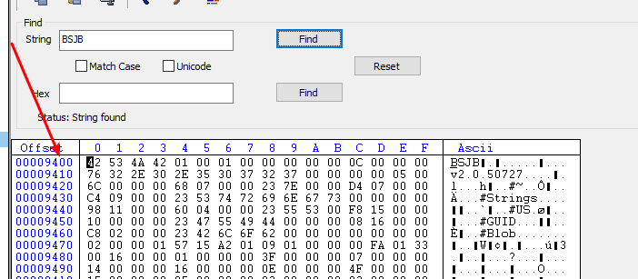

接着点击查找，找到了0x9400这个地址，那么Meta Data的Offset就是0x9400。

接着把9400输入到Offset中，会自动计算出我们要的RVA是0xA400。

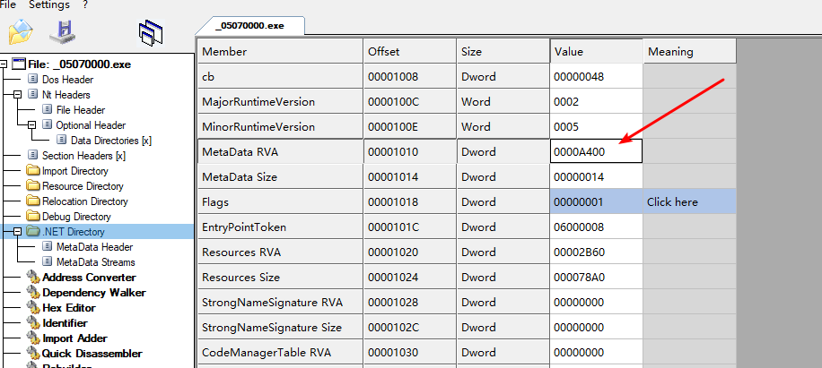

回到Directoy部分，将正确的RVA填入。至于Size我们可以根据一个公式计算得出:MetaDataSize=Import Directory RVA-MetaDataRVA,Import Directory RVA的值如下图：

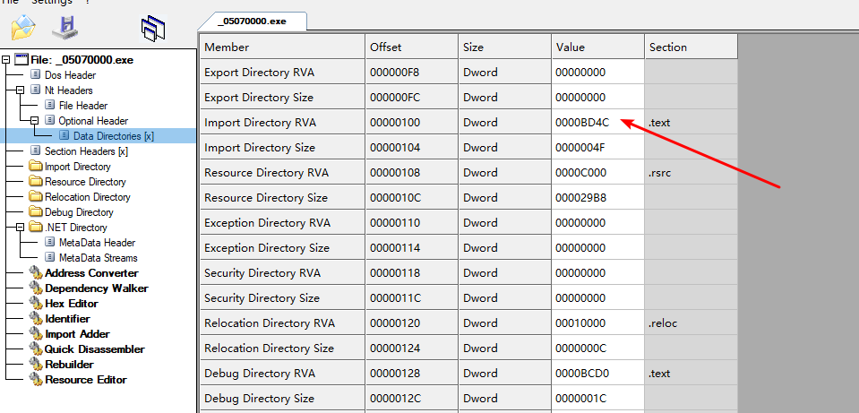

最后算出Size为0x194C。

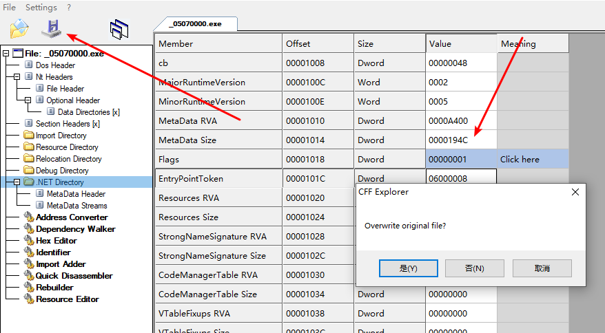

接着修改回正确的RVA，然后点击保存。

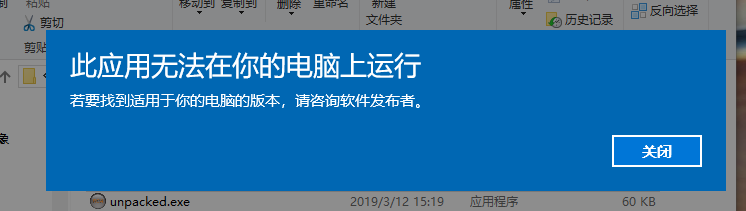

接着再次双击测试运行，还是无法运行。这里作者的原话是根据我之前的经验，我应该是忘记修改文件头属性了。

不得不感叹大神的经验就是强大。好吧 继续修复

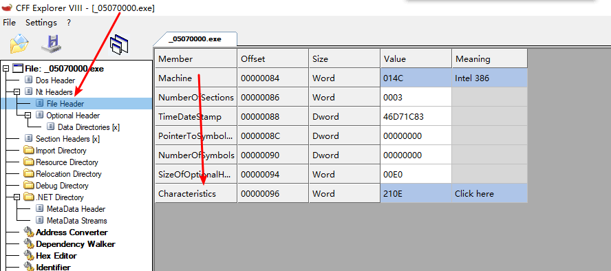

点击文件头 找到Characteristics，双击

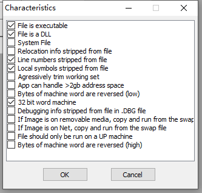

属性显示这是一个DLL，难怪会报错。把勾去掉，再次保存。

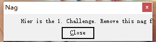

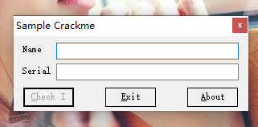

OK 程序完美运行，这个壳也算是脱完了。

需要相关文件可以到我的Github下载:https://github.com/TonyChen56/Unpack-Practice