[TOC]

### 查壳

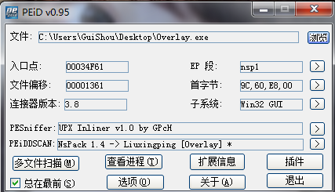
拿到样本之后先查壳 发现是NsPack 后面还有个Overlay 看到这个就要警惕了 说明PE程序尾部有附加数据

### OD脱壳

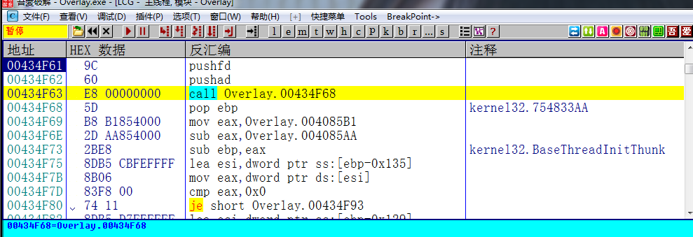
载入OD之后在入口点发现了pushfd和pushad 于是采用最快的脱壳方法
使用Ctrl+S键 查找所有命令
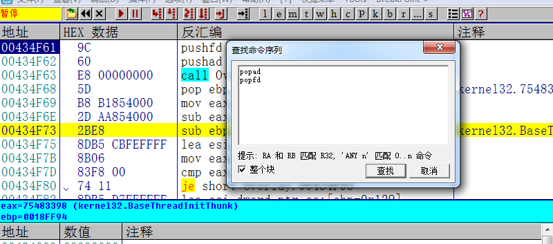
查找对应的两条命令
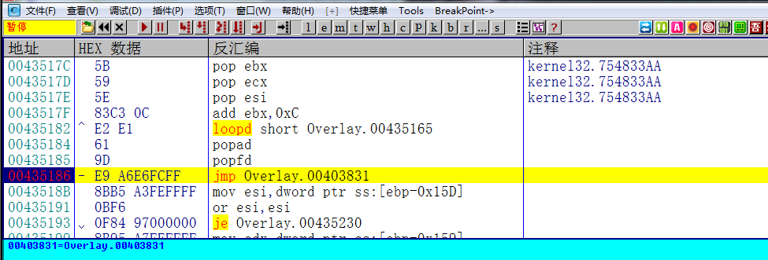
在jmp的地方下断点 F7就能到达OEP 之后dump文件

### 修复导入表

这一次我们使用LoadPE脱壳 选中目标进程 依次执行下面两个步骤

1. 修正镜像大小
2. 完整转存

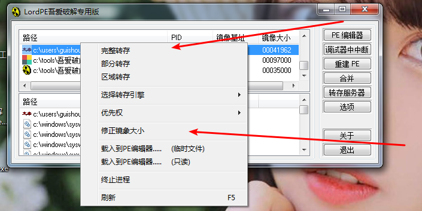
接着使用ImportREC修复导入表
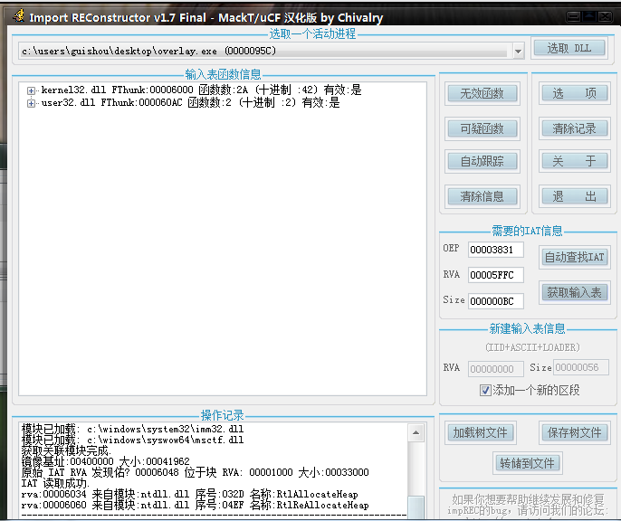
查找到的IAT只有两条 明显有问题 直接dump文件
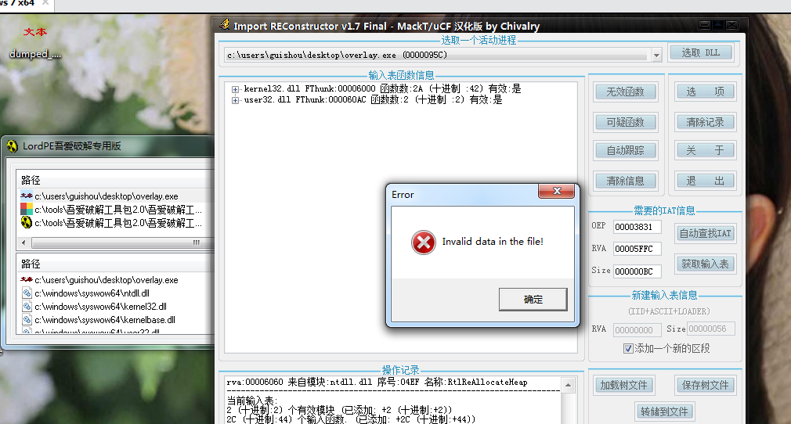
运行之后 显示文件中的数据无效 应该是刚刚的附加数据的问题

### 处理附加数据

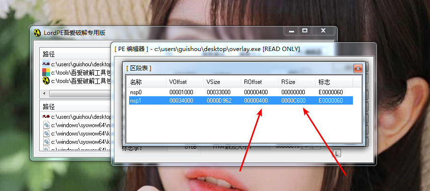
将原程序用LoadPE查看 计算出PE文件的结束位置 即ROffset+RSize=0xCA00
将目标程序拖进010Edit 找到0xCA00的位置 右键选择 标记选择开始
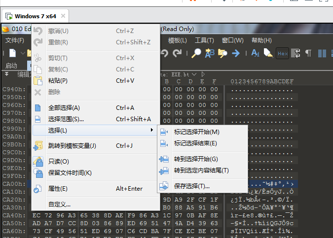
然后拖到最下面 右键选择 标记选择结束 复制数据

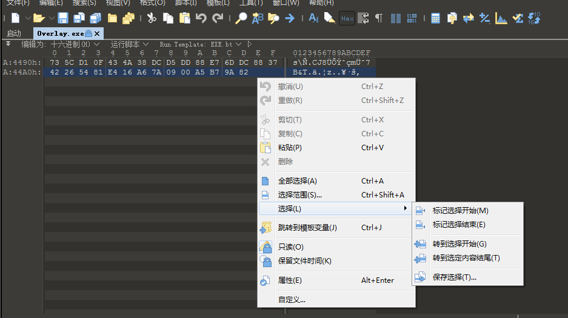接着打开已经脱壳修复好的文件 拖到文件末尾 粘贴数据 保存
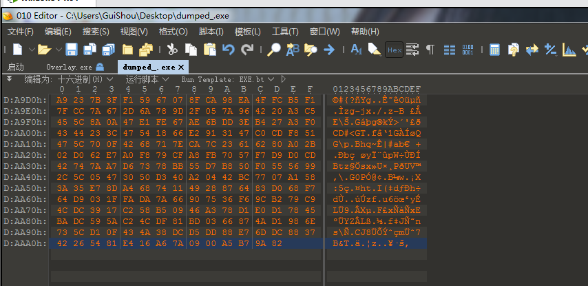
程序正常运行 脱壳完成
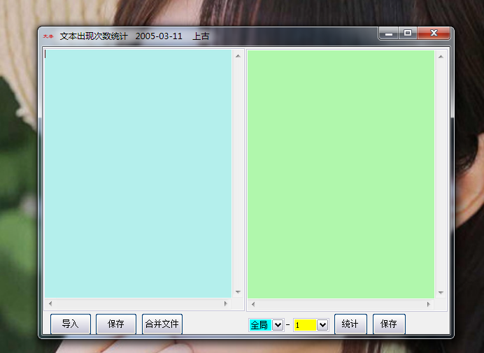

### 关于附加数据

关于附加数据 不同的壳情况也不一样  总的来说 会有三种情况

#### NO.1

有些壳虽然有overlay但是却不用特别处理 因为他根本就没有用到过这些数据

#### NO.2

为什么有些壳要定位指针？ 所谓的dump就是把内存中的数据转储到磁盘 dump下来之后 文件对齐和内存对齐粒度不一样 overlay数据的起始地址就相应的发生了改变 所以在这个时候直接粘贴附加数据是行不通的  当需要重设指针的时候需要在脱壳后的程序的`SetFilePointer`下断点 然后对原先的文件指针进行栈回溯跟踪 一直往上找到赋值的位置 然后修改会正确的指针 就可以了

#### NO.3

但是为什么有些壳可以直接粘贴overlay数据呢 这是因为目标程序在使用附加数据的时候需要用到两个函数 一个是`CreateFile` `SetFilePointer` 一个用于打开文件 一个用于设置文件指针

```C++
   DWORD SetFilePointer(
                         HANDLE hFile,                //在用CreateFileA打开后得到的文件句柄
                        LONG lDistanceToMove,         //要移动的距离，这个是低32位
                        PLONG lpDistanceToMoveHigh,  //要移动的距离，这是高32位，要注意这是一个指向数据的指针
                        DWORD dwMoveMethod          //表示指针开始的位置
                        );
```

使用这个函数的时候会出现一种情况 就是讲第四个参数直接设置为`FILE_END` 然后将第二个参数设置为一个负值 负数表示向前移动 FILE_END表示设置到文件末尾  而附加数据无论在原来未脱壳的文件中和还是在脱壳的文件中，因为我们复制的是整个overlay区域，他的overlay部分的数据对于最后的一个字节的距离是不变的。他每次都用FILE_END当然我们这样复制就不需要重定位指针了，也就是说即使我们把原来的文件（从0地址开始）全部复制到脱壳后的文件中也是能够运行的，因为他是靠与最后的地址的距离来定位读取数据。换个说法，如果这个时候你把最后一个数据删掉，或者少复制哪怕是一个字节，就不能运行了。这也是我们为什么要先修复导入表的原因
总结：也就是说如果你把附加数据复制到脱壳后的程序发现能够运行，呵呵~恭喜你，你碰巧遇到用FILE_END为指针的程序。
关于附加数据可以去看Lenux大神的浅谈脱壳中的附加数据问题（overlay） 附上看雪链接 以上三个问题也是我从这篇文章中得到答案的
`https://bbs.pediy.com/thread-9182.htm`

需要相关文件可以到我的Github下载:https://github.com/TonyChen56/Unpack-Practice

