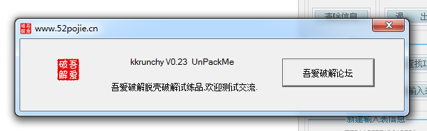

[TOC]

## 前言

最近一直在看脱壳系列的教程，国内能找到的脱壳视频几乎都看了个遍，大部分由于年代实在是太久了，附带的示例程序完全不能运行，或者是某些未知原因用相同的步骤中间总是会出差错，后来找到了 **吾爱破解脱壳练习系列动画**，主讲人是论坛的小生大神，感觉这个系列的教程是最适合我的，这个例子是 **吾爱破解脱壳练习系列动画**的第一课，一个有点类似的FSG的压缩壳。

## 查壳

目标程序是这个，一个不怎么常见的压缩壳吧，直接脱壳

## OD脱壳

载入到OD，

在push edi下一条指令下断点，下ESP断点 然后F9运行

停到这里，删除硬件断点，单步跟，遇到向上的跳转就F4运行到下一条

然后在这里会看到一个远跳，直接回车跟进去，下硬件执行断点

接着重新载入程序，直接F9

就到达OEP了

## 修复导入表

接着dump文件，自动查找IAT，获取输入表，转储文件

转储之后，文件正常运行

脱壳完成

需要相关文件可以到我的Github下载:https://github.com/TonyChen56/Unpack-Practice

