[TOC]
### 查壳
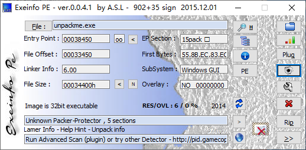
目标程序链接器版本是6.0 可能是VC6写的程序 PEiD查壳没有查出来，应该是别人自写的一个壳

### OD脱壳
载入之后到达壳的入口点 采用单步跟踪的方式找到程序的OEP 一直单步之后 到达OEP
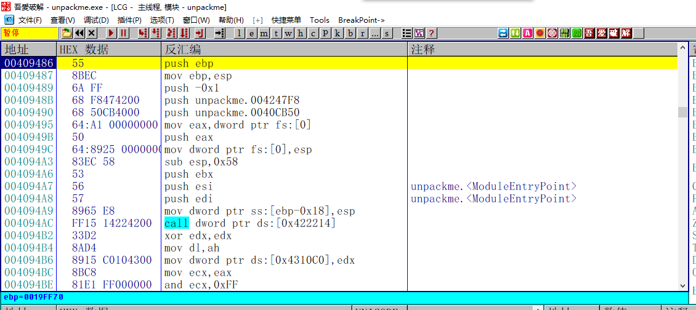
在入口处 我们发现程序符合VC6的入口特征 但是第一个call并不是GetVersion
查看内存 发现IAT被加密了  这个时候 如果直接dump内存 程序就无法运行 必须先将IAT解密  解密IAT的方法就是找到写入

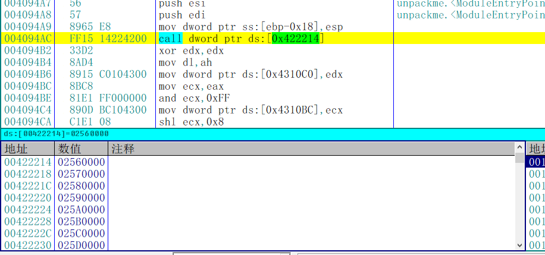

IAT的位置 然后将函数原本未加密的地址写回去 即可完成解密

### 解密IAT
所以 我们在IAT处下硬件写入断点 找到写入IAT的地方

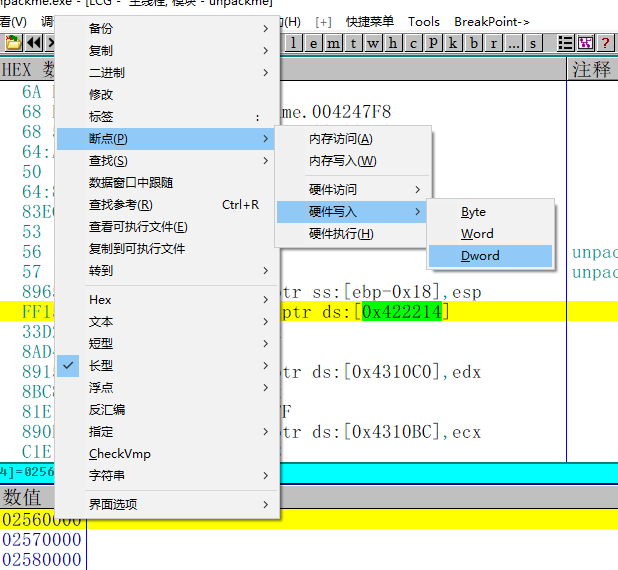

重启程序 一直按F9找到加密IAT的地方
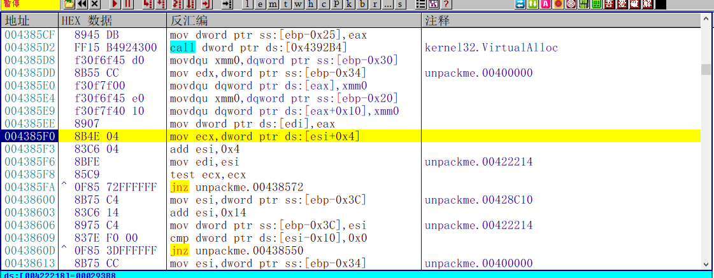
一般加密IAT的地方都会有一个规律 `mov dword ptr ds:[edi],eax`都是类似这样的格式
找到IAT之后 一般有两种处理方式 一是重启程序  在`LoadLibraryA/W` `GetProcAddress`下API断点 二是继续单步跟踪 找到IAT原本的地址 因为一般加密IAT的地方是个循环 这里我们采取第二种方法
单步几次之后 我们发现程序使用`GetProcAddress`获取到了函数地址 之后对这个地址进行了异或
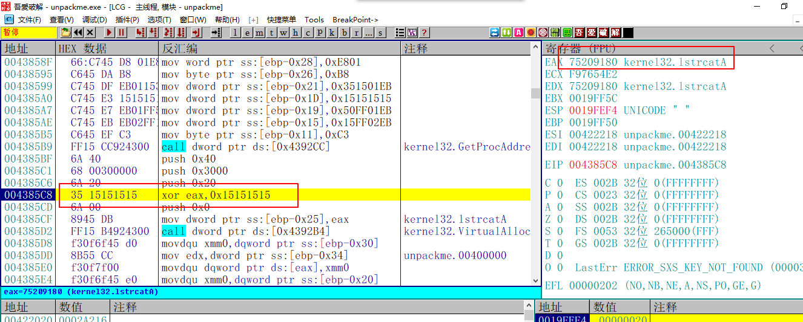
之后又申请了一块空间 将加密后的地址填充到这块空间里
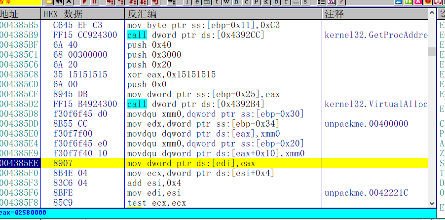
我们只需要将加密前的IAT填充回去就完成了解密
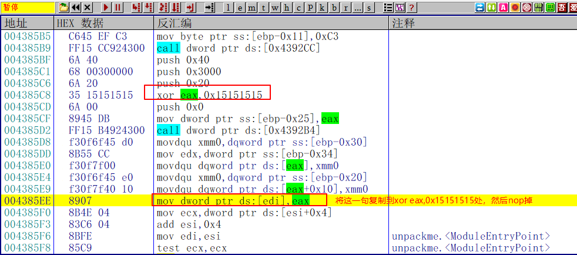

修改后的代码如下
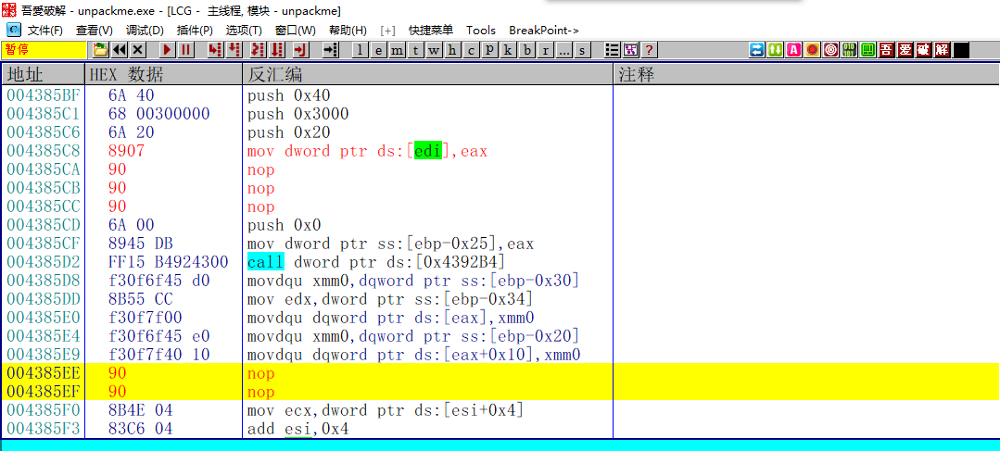
之后单步到OEP处
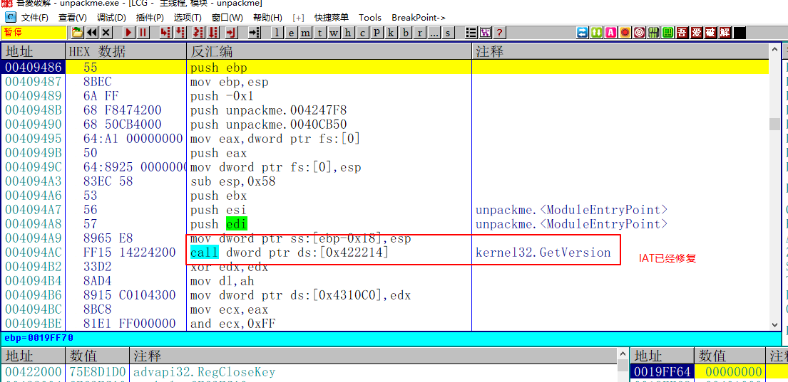
可以发现 IAT解密已经完成 然后dump文件 修复IAT即可  
在手动修复IAT的时候要注意 当单步跟踪找到了写入IAT和获取IAT地址时  应该重新加载程序 在程序写入IAT之前完成对代码的修改 因为如果在单步跟踪的时候直接修改 这个时候程序已经加密了部分的代码 此时再去修复IAT就会出问题 但是如果用写脚本的方式就不需要担心这种问题

### 修复导入表

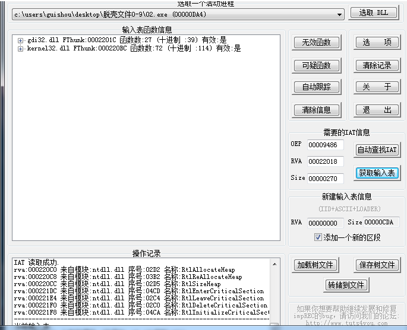

然而 当我们使用ImportREC修复导入表时 我们发现 软件并没有能完整的识别所有的IAT信息  只搜索到两个模块的导入信息 在遇到这种情况一般采取的方法有两种 一种是将ImportREC自动分析的RVA取整 Size增加到1000 这样也能比较完整地分析全IAT表 只是会分析出很多无用函数 还有一种是手动查看IAT区域的基址和大小 然后填入ImportREC的RVA和Size中 这里我们采取第二种方法
先在OD中观察IAT表的起始位置 是422000
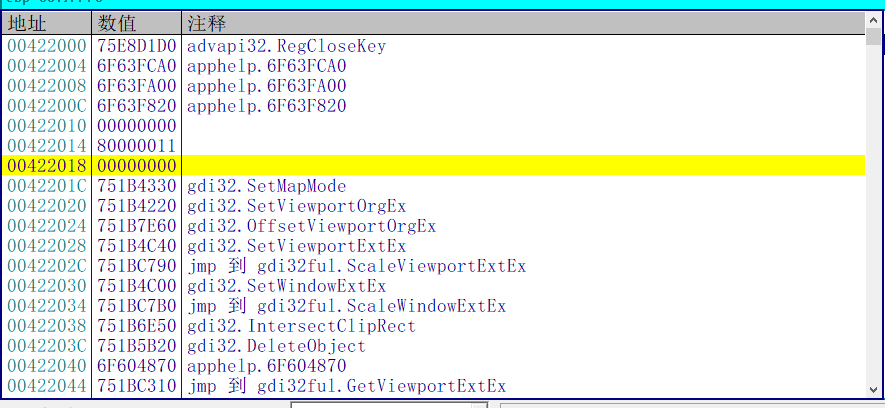
然后找到结束位置 422504
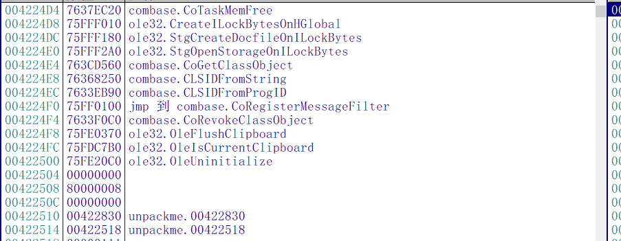
由此得出IAT表的大小 是504
重新在ImportREC中指定RVA和Size 点击获取输入表
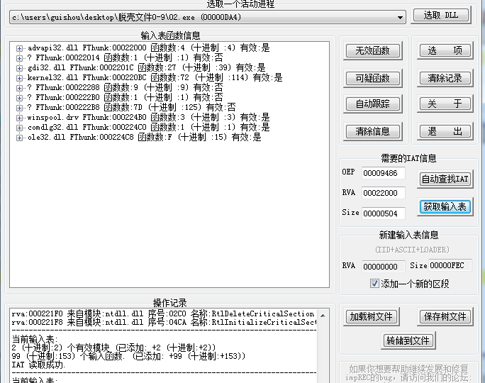
在获取到的函数地址中 会有一部分无效的  一般无效的看能否修复 如果可以修复就修复 如果不能修复就剪切掉
在分析的无效函数中 有一种转发函数 被分析成了无效函数 如图中的`NtdllDefWindowProc_A`
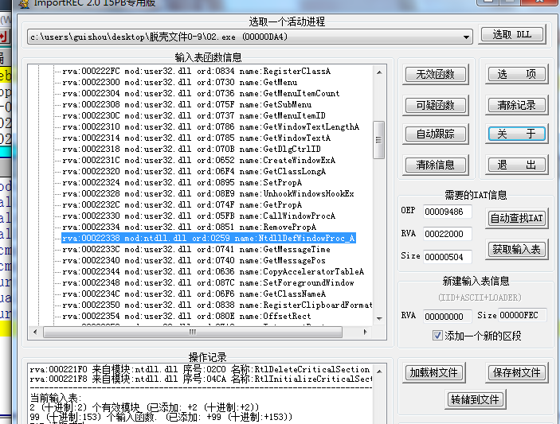
这种无效函数的成因其实是函数被转发了 上面的函数在user32中的函数名的`DefWindowProcA` 而在user32模块中这个函数地址空间并没有实际的代码 而只是一个函数名 类似的函数还有几个
这种函数可以使用ImportREC修复 双击函数名  然后先选择模块 再填入函数名
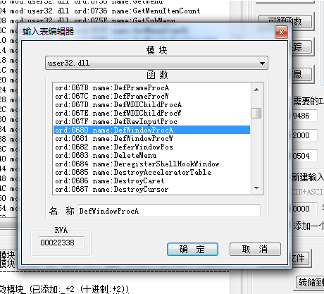
如果还有无效函数 就右键剪切掉
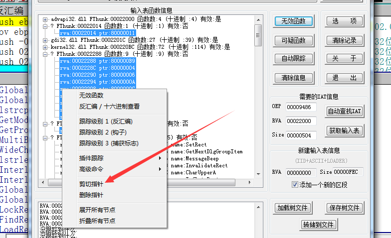
当没有无效函数的时候 就可以转储文件了，程序正常运行

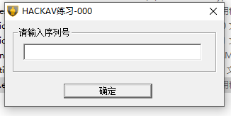

注意，我的运行环境是W7 64位，脱壳后的程序放到我的W10物理机上的跑不起来的

### 破解Crackme

既然是个Crackme，就顺手把他干掉吧

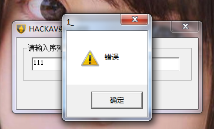

根据字符串提示找到来自401557的地址

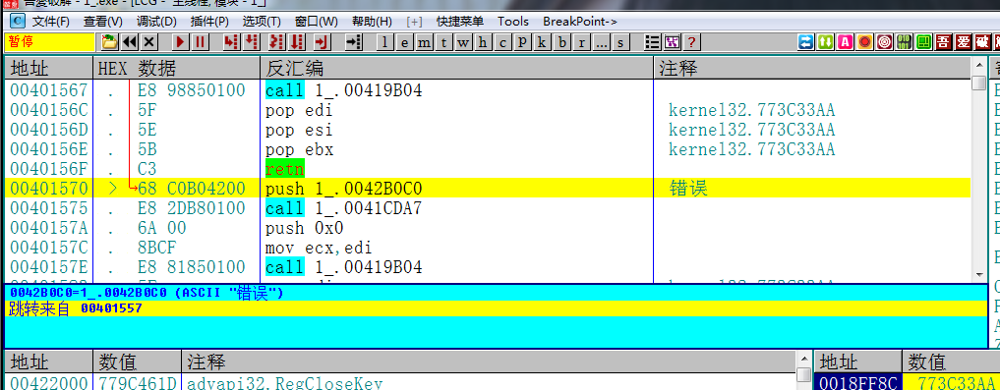

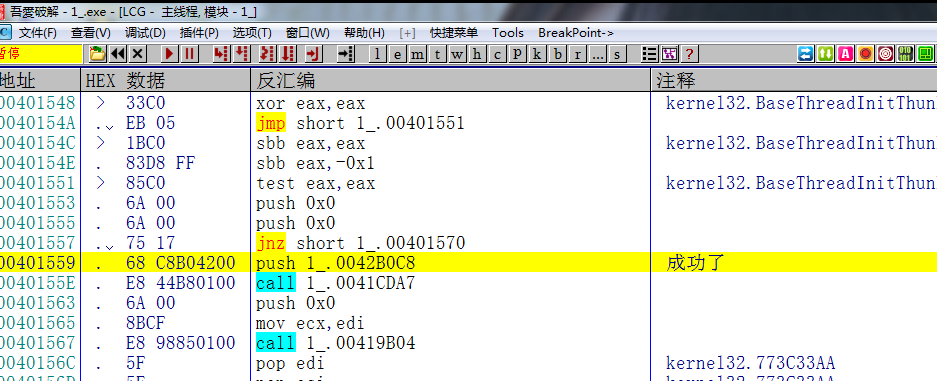

然后就来到了成功的地方

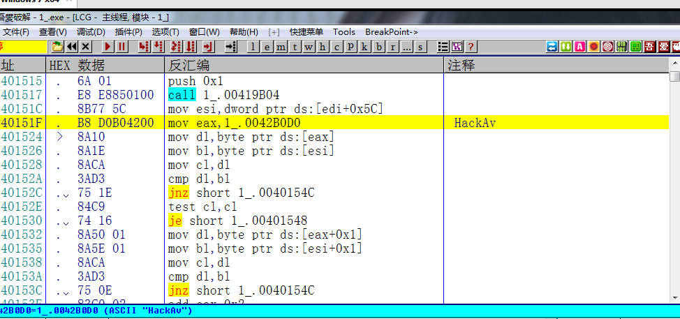

接着往上翻，发现这里有一个HackAv,直接输入

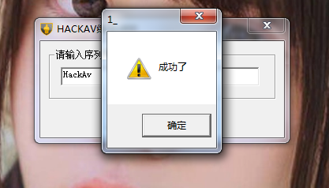

提示成功，破解完成

需要相关文件可以到我的Github下载:https://github.com/TonyChen56/Unpack-Practice